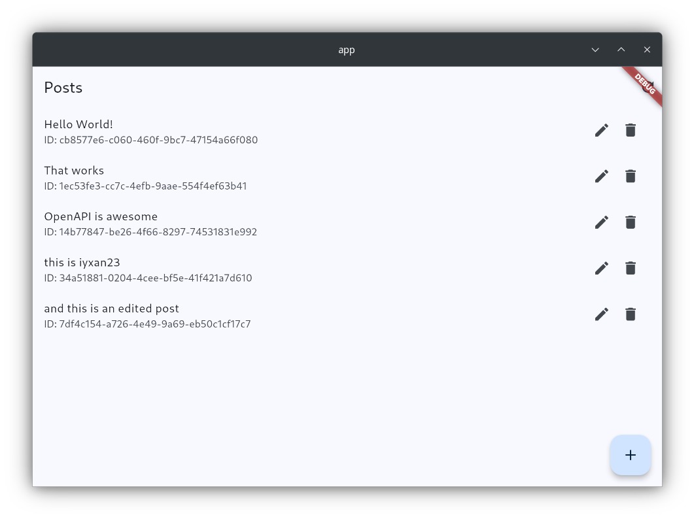
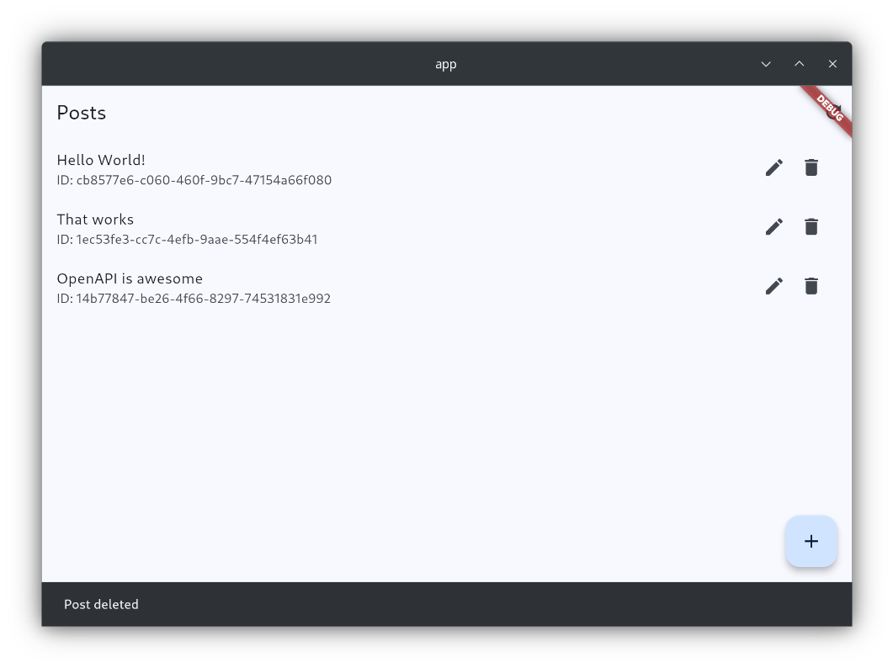

# OpenAPI-first Development Example

This project demonstrates an API-first development workflow using an Express.js backend and a Flutter frontend. The API contract is defined using the OpenAPI specification, which serves as the single source of truth for both the server and the client.

## Core Technologies

*   **OpenAPI (Swagger)**: For defining the API contract (`shared/openapi.json`).
*   **Backend (Express.js)**:
    *   `express`: Web framework for Node.js.
    *   `openapi-backend`: Middleware for request validation, routing, and response mocking based on the OpenAPI spec.
    *   `tsx`: For running TypeScript with hot-reloading (`npm run dev`).
    *   `ajv-formats`: To provide support for formats like `uuid` in the JSON schema validator.
*   **Frontend (Flutter)**:
    *   `openapi_generator`: For generating a type-safe Dart API client from the OpenAPI spec.
    *   `dio`: HTTP client for Dart.
    *   `flutter_riverpod`: For state management.
    *   `built_value` & `built_collection`: For immutable value types and serialization (used by the generated client).

## Project Structure

```
. 
├── app/                # Flutter frontend application
├── backend/            # Express.js backend server
├── shared/             # Shared OpenAPI specification (openapi.json)
└── .github/            # Screenshots for README
```

## API Specification

The API is defined in `shared/openapi.json`. This file is used by:
1.  The **backend** (`openapi-backend`) to validate requests and route them to handlers.
2.  The **frontend** (`openapi_generator`) to generate the Dart API client.

Any changes to the API should be made in this file first, and then both the backend and frontend should be updated accordingly.

## Backend Setup (Express.js)

Located in the `backend/` directory.

1.  **Install Dependencies**:
    ```bash
    cd backend
    npm install
    ```
2.  **Run the Server** (with hot-reloading for development):
    ```bash
    npm run dev
    ```
    The server will typically run on `http://localhost:9000`.

## Flutter App Setup

Located in the `app/` directory.

1.  **Install Flutter Dependencies**:
    ```bash
    cd app
    flutter pub get
    ```
2.  **Generate API Client**:
    The Flutter app uses a generated API client located in `app/api/post_api/`. To (re)generate this client after changes to `shared/openapi.json` or the generator configuration:
    ```bash
    flutter pub run build_runner build --delete-conflicting-outputs
    ```
3.  **Run the App** (example for Linux desktop):
    Ensure the backend server is running.
    ```bash
    flutter run -d linux
    ```

## Screenshots

Here's a glimpse of the Flutter application in action:

| Main App View                                   | Post Deletion                   |
| :----------------------------------------------: | :------------------------------------------: |
|       |  |

## Key Learnings & Features Demonstrated

*   **API-First Workflow**: Defining the API contract before implementation reduces integration friction.
*   **Schema Validation**: `openapi-backend` automatically validates incoming requests against the schema, ensuring data integrity.
*   **Type-Safe Client**: `openapi_generator` creates a Dart client that makes API interactions less error-prone and provides compile-time checks.
*   **Shared Knowledge**: The OpenAPI spec acts as a shared understanding between backend and frontend teams (or developers).
*   **Serialization**: Addressed common serialization challenges with `built_value` in Flutter by using `StandardJsonPlugin` (via `standardSerializers`) for robust JSON conversion.
*   **Format Validation**: Handled specific format validation (e.g., `uuid`) in the backend by configuring `ajv-formats` with `openapi-backend`.

This example provides a solid foundation for building more complex applications using an API-first approach with Express and Flutter.
